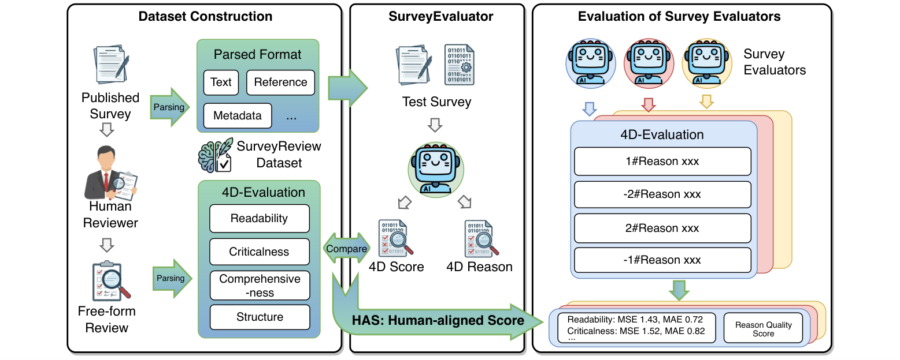

<h1 align="center">
  
  SurveyReview
</h1>

<p align="center">
  <b>A Reviewer-Aligned Benchmark for Survey Evaluators</b>
</p>

<p align="center">
  <a href="https://surveyreview.github.io/"></a>
  <a href="https://huggingface.co/datasets/brighterrluo/SurveyReview"></a>
</p>

<p align="center">
  
</p>

SurveyReview is a reviewer-aligned benchmark for evaluating survey papers. It converts real peer-review reports into multidimensional evaluation labels and rationales, allowing models to be tested against how human reviewers judge survey quality.

`v1.1/`: the updated release using cleaned article texts.

The benchmark focuses on four survey-review dimensions: **Readability**, **Criticalness**, **Comprehensiveness**, and **Structure**. It provides standardized train/test splits, article metadata, prompt files, and an API-based evaluation pipeline.

## Quick Start

Create an environment and install dependencies:

```bash
python -m venv .venv
source .venv/bin/activate
pip install -r requirements.txt
```

Configure the API client:

```bash
cp .env.example .env
```

Then edit `.env`:

```text
API_KEY=your-api-key-here
BASE_URL=https://api.openai.com/v1
MODEL_NAME=gpt-5.2
JUDGE_MODEL=gpt-5.2
EVALUATE_REASONS=True
```

Run the default test-set evaluation:

```bash
python src/api_base_evaluate.py
```

Run on the train split:

```bash
EVAL_SPLIT=train python src/api_base_evaluate.py
```

Outputs are written to `result/<timestamp>/`:

| File | Description |
| --- | --- |
| `results.csv` | MSE, MAE, accuracy, and sample counts for each dimension. |
| `predictions_<dimension>.jsonl` | Per-sample prediction records. |
| `run_config.json` | Runtime configuration and split statistics. |
| `rqs_<dimension>.json` | Rationale quality results when `EVALUATE_REASONS=True`. |

## Leaderboard(v1.0)

Lower MSE/MAE is better. Higher HAS/RQS is better.

<table>
  <thead>
    <tr>
      <th rowspan="2">Rank</th>
      <th rowspan="2">Model</th>
      <th rowspan="2">HAS</th>
      <th colspan="2">Read.</th>
      <th colspan="2">Crit.</th>
      <th colspan="2">Comp.</th>
      <th colspan="2">Stru.</th>
      <th colspan="2">Average</th>
      <th rowspan="2">RQS</th>
    </tr>
    <tr>
      <th>MSE</th><th>MAE</th>
      <th>MSE</th><th>MAE</th>
      <th>MSE</th><th>MAE</th>
      <th>MSE</th><th>MAE</th>
      <th>MSE</th><th>MAE</th>
    </tr>
  </thead>
  <tbody>
    <tr>
      <td>1</td>
      <td><b>SurveyReviewer</b></td>
      <td><b>0.74</b></td>
      <td><b>1.43</b></td><td><b>0.72</b></td>
      <td><b>1.52</b></td><td><b>0.82</b></td>
      <td><b>1.26</b></td><td><b>0.56</b></td>
      <td><b>1.29</b></td><td><b>0.65</b></td>
      <td><b>1.38</b></td><td><b>0.69</b></td>
      <td>0.36</td>
    </tr>
    <tr>
      <td>2</td>
      <td>GPT-5.2</td>
      <td>0.68</td>
      <td>2.13</td><td>1.07</td>
      <td>1.97</td><td>0.97</td>
      <td>2.04</td><td>1.08</td>
      <td>2.98</td><td>1.47</td>
      <td>2.28</td><td>1.15</td>
      <td>0.42</td>
    </tr>
    <tr>
      <td>3</td>
      <td>Claude-Opus-4.5</td>
      <td>0.68</td>
      <td>2.91</td><td>1.29</td>
      <td>1.88</td><td>0.88</td>
      <td>2.66</td><td>1.23</td>
      <td>3.65</td><td>1.58</td>
      <td>2.77</td><td>1.25</td>
      <td><b>0.48</b></td>
    </tr>
    <tr>
      <td>4</td>
      <td>Qwen3-32B</td>
      <td>0.61</td>
      <td>3.05</td><td>1.45</td>
      <td>3.24</td><td>1.51</td>
      <td>3.22</td><td>1.54</td>
      <td>3.35</td><td>1.53</td>
      <td>3.21</td><td>1.51</td>
      <td>0.36</td>
    </tr>
    <tr>
      <td>5</td>
      <td>GLM-4.7</td>
      <td>0.60</td>
      <td>3.43</td><td>1.50</td>
      <td>2.58</td><td>1.21</td>
      <td>3.66</td><td>1.57</td>
      <td>4.83</td><td>1.95</td>
      <td>3.62</td><td>1.56</td>
      <td>0.37</td>
    </tr>
    <tr>
      <td>6</td>
      <td>gemini-3-pro</td>
      <td>0.58</td>
      <td>3.84</td><td>1.52</td>
      <td>2.25</td><td>1.00</td>
      <td>3.91</td><td>1.49</td>
      <td>5.76</td><td>2.11</td>
      <td>3.94</td><td>1.53</td>
      <td>0.29</td>
    </tr>
    <tr>
      <td>7</td>
      <td>DeepSeek-v3.2</td>
      <td>0.58</td>
      <td>4.78</td><td>1.88</td>
      <td>2.49</td><td>1.15</td>
      <td>4.59</td><td>1.82</td>
      <td>4.02</td><td>1.76</td>
      <td>3.97</td><td>1.65</td>
      <td>0.37</td>
    </tr>
  </tbody>
</table>

## Notes

- `v1.0/` contains the original SurveyReview release and `v1.0-paper` data for paper reproduction.
- `v1.1/` contains the updated release using cleaned article texts.
- Article files are split into JSON shards to stay within GitHub file-size limits.
- Both releases keep the SurveyReview evaluation style: MSE/MAE plus optional RQS. If you only want to verify the pipeline, set `EVALUATE_REASONS=False` to skip the judge-model stage.
